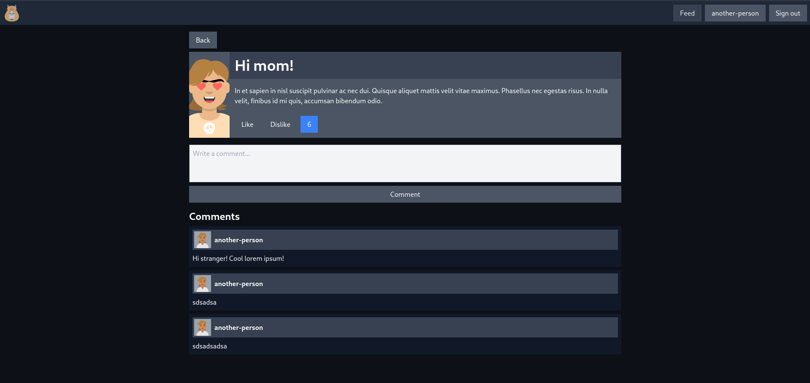

# SOCIALLY AWKWARD 🤓

You will need PNPM, Caddy, NodeJS, Docker and Docker Compose installed.

## OBJECTIVE 🎯

I'm building this project to learn more about some technologies I'm interested in. Nest, MongoDB, Monorepos and Caddy are some of them.

> warning: This is not a real project, so I'm not sure if I'll finish it. In the current moment this is just a playground, full of bugs and bad practices.





## RUN 🏃‍♂️

Run the following commands in the root directory of the project.

- Run docker-compose

```bash
docker-compose up -d
```

- Install dependencies

```bash
pnpm install
```

- Run the project in development mode

```bash
pnpm dev
```

- Run Caddy server

```bash
caddy start
```

- Access the project at [https://socially-awkward.localhost/](https://socially-awkward.localhost/)


Caddy does a reverse proxy to the apps.

Every request that hits the `/api/*` path is redirected to the API app.

Every other request is redirected to the web app.

## MORE COMMANDS 🤓

- In another terminal, run the following command to watch the logs from mongo

```bash
docker logs socially-awkward-mongo
```

- If you want to bash into the mongo container

```bash
docker exec -it socially-awkward-mongo bash
```

- You can try the `mongodb.mongodb-vscode` VSCODE extension too

# STACK 🥞

This is a monorepo built with [PNPM](https://pnpm.io/) and [Turbo](https://turbo.build/).

For the API, I'm trying out [NestJS](https://nestjs.com/) and [MongoDB](https://www.mongodb.com/).

I'm using [Docker](https://www.docker.com/) with [Docker Compose](https://docs.docker.com/compose/) to run the DB.

For the web app, I'm using [Vite](https://vitejs.dev/) with [React](https://react.dev/). The routing is handled by [React Router](https://reactrouter.com/) and the data fetching is done with [React Query](https://react-query.tanstack.com/).

The styling is done with [TailwindCSS](https://tailwindcss.com/) (I've been learning it for a while now and I'm really enjoying it).

[Caddy](https://caddyserver.com/) is used as a reverse proxy to the apps. Thanks to it, I can use HTTPS locally and solve some cookies issues.

## USING THE API 🤖

You can find the documentation on the [API README](./apps/api/README.md).

### USING THE AWKWARD-CLIENT 🤖

You can use the [awkward-client](./packages/awkward-client/) to interact with the API.

```ts
import { AwkwardClient } from 'awkward-client';

const apiClient = new AwkwardClient('https://socially-awkward.localhost/api');
```

## TODO 📝 (maybe... 🤔)

There are a lot of things todo and this is not a real project, so I'm not sure if I'll finish it.

- [ ] Finish the frontend
- [ ] Guarantee that the user can only delete its own posts and comments
- [ ] Add a way to upload images
- [ ] Add pagination to the posts and comments
